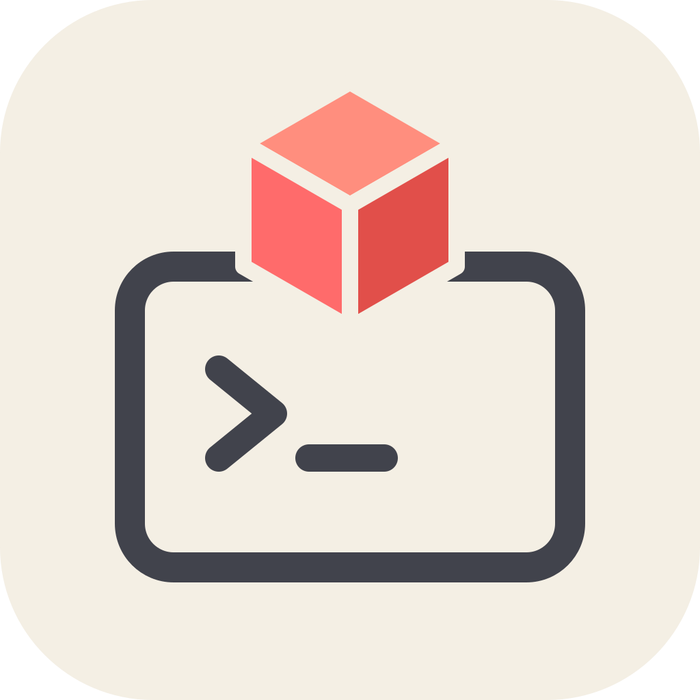

# Codex Delegate MCP

**Keep the brains. Delegate the build.**

[](https://www.npmjs.com/package/codex-delegate-mcp)
[](https://www.npmjs.com/package/codex-delegate-mcp)
[](https://nodejs.org)
[](LICENSE)
[](https://github.com/andreilungeanu/codex-delegate-mcp/actions/workflows/test.yml)



Use your best coding agent where its judgment matters most: understanding the task, shaping the plan, and reviewing the result.

Codex Delegate is the MCP bridge that lets Claude Code, ChatGPT/Codex, Copilot — or any MCP client — hand implementation to the **OpenAI Codex CLI**, then get a clean, structured result back for review.

<br clear="left">

## Frontier quality, kept

Your assistant does what frontier models are actually for: understands the task, writes a precise brief, reviews the finished diff. Codex holds its own as the implementer — guided and checked by a smarter orchestrator. The result reads like frontier work, because a frontier model planned it and signed off on it.

## Done faster

Codex tears through multi-file edits while a frontier chat model would still be streaming the first file. You delegate, keep working with your assistant, and the diff shows up done.

## Your limits stop being the bottleneck

Delegated work runs on the **OpenAI Codex CLI** and its own usage — separate from your orchestrator's chat quota. Your Claude or Copilot subscription spends tokens on the brief and the review; Codex does the grinding. On API? That's the per-token grind moved off your main bill.

```
You  →  your agent (plans & reviews)
              │  MCP delegate tool
              ▼
        Codex CLI (implements)
              │  edits your workspace
              ▼
        Clean result: what changed, which files, the thread id
```

## Features

- **Native plugins** — install into Claude Code, ChatGPT/Codex, or GitHub Copilot CLI and just say *"delegate this to Codex"*. The shared skill teaches your agent how to delegate well.
- **Truthful finals** — only `--output-last-message` after a clean exit counts as the answer. No JSONL guesswork.
- **Clean, typed results** — final answer, `filesReportedByAgent`, session/`threadId`, plan JSON, warnings, and status.
- **Plan / ask / review** — structured `plan` mode, read-only `ask`, and Codex-native `review`.
- **Cancel that works** — one in-flight op with process-tree kill across platforms.
- **Resume** — continue the same Codex thread with `resumeThreadId`.
- **Self-diagnosing** — a `doctor` tool for setup and help-only deep checks.
- **Works everywhere MCP does** — VS Code, JetBrains, Windsurf, Visual Studio, and more.

## Quick start

You need [Node.js 18+](https://nodejs.org/) and the [OpenAI Codex CLI](https://github.com/openai/codex) **0.144.0+**, already logged in (`codex login`).

### Claude Code

```shell
/plugin marketplace add andreilungeanu/codex-delegate-mcp
/plugin install codex-delegate-mcp@codex-delegate-mcp
```

Then just ask:

> Delegate to Codex: migrate src/api from callbacks to async/await and update the tests, then walk me through what changed.

That's the whole loop — Claude writes the brief, Codex grinds through the files, Claude walks you through the diff.

### ChatGPT desktop / Codex

```shell
codex plugin marketplace add andreilungeanu/codex-delegate-mcp
codex plugin add codex-delegate-mcp@codex-delegate-mcp
```

### GitHub Copilot CLI

```shell
copilot plugin install andreilungeanu/codex-delegate-mcp
```

### More clients

<details>
<summary><strong>VS Code</strong> — <code>.vscode/mcp.json</code></summary>

```json
{
  "servers": {
    "codex-delegate-mcp": {
      "type": "stdio",
      "command": "npx",
      "args": ["-y", "codex-delegate-mcp"]
    }
  }
}
```

Or run **Chat: Install Plugin From Source** with this repository's URL.

</details>

<details>
<summary><strong>JetBrains AI Assistant</strong> — Settings → Tools → AI Assistant → MCP</summary>

Under **Settings → Tools → AI Assistant → Model Context Protocol (MCP)**, add a server with command `npx` and arguments `-y codex-delegate-mcp`.

</details>

<details>
<summary><strong>Windsurf</strong> — <code>~/.codeium/windsurf/mcp_config.json</code></summary>

```json
{
  "mcpServers": {
    "codex-delegate-mcp": {
      "command": "npx",
      "args": ["-y", "codex-delegate-mcp"]
    }
  }
}
```

Heads-up: Cascade caps you at 100 tools across all servers.

</details>

<details>
<summary><strong>Visual Studio 2022</strong> — <code>%USERPROFILE%\.mcp.json</code></summary>

```json
{
  "servers": {
    "codex-delegate-mcp": {
      "type": "stdio",
      "command": "npx",
      "args": ["-y", "codex-delegate-mcp"]
    }
  }
}
```

Requires 17.14+. Note the top-level key is `servers`, not `mcpServers`.

</details>

### Kiro, Kilo Code, and any other MCP client

Add the following server to the client's MCP config:

```json
{
  "mcpServers": {
    "codex-delegate-mcp": {
      "command": "npx",
      "args": ["-y", "codex-delegate-mcp"]
    }
  }
}
```

## Notes

This is a **worker** for an orchestrator host — not a replacement for Codex's first-party `codex mcp-server`. The host writes the brief and reviews the git diff; this bridge runs `codex exec --json` with hooks disabled and `--ignore-user-config`, then returns evidence the host can trust. Project `.codex` config may still apply under Codex's normal precedence — treat the workspace as trusted.

Optional: set `CODEX_DELEGATE_COMMAND` to an absolute Codex binary. On Windows the standalone install under `~/.codex/packages/standalone/releases/` is preferred over the PATH shim.

Defaults: `model=gpt-5.6-terra`, `reasoningEffort=high`, `network=false`, `fast=false`, idle timeout 90s, hard cap 1h (`timeoutMs`).

## License

MIT © [Andrei Lungeanu](https://github.com/andreilungeanu)

<sub>[Security](SECURITY.md) · [Privacy](PRIVACY.md) · [Terms](TERMS.md) · [Changelog](CHANGELOG.md)</sub>
