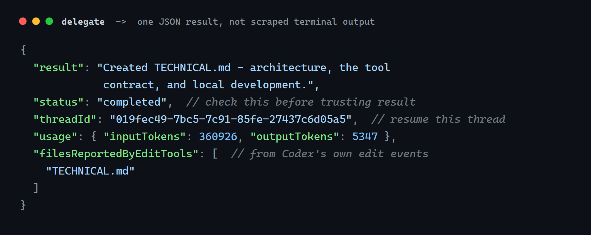

# Codex Delegate

**Stop burning your frontier agent's limits on boilerplate.**

Delegate implementation to the **OpenAI Codex CLI** — your agent writes the brief and reviews the diff.

[](https://www.npmjs.com/package/codex-delegate-mcp)
[](https://www.npmjs.com/package/codex-delegate-mcp)
[](https://registry.modelcontextprotocol.io/v0/servers?search=codex-delegate)
[](https://glama.ai/mcp/servers/andreilungeanu/codex-delegate-mcp)
[](https://nodejs.org)
[](LICENSE)
[](https://github.com/andreilungeanu/codex-delegate-mcp/actions/workflows/test.yml)


Use your best coding agent where its judgment matters most: understanding the task, shaping the plan, and reviewing the result.

Codex Delegate is the MCP bridge that lets Claude Code, Cursor, Copilot — or any MCP client — hand implementation to the **OpenAI Codex CLI**, then get a clean, structured result back for review.

<br clear="left">

## 🧠 Frontier quality, kept

Your assistant does what frontier models are actually for: understands the task, writes a precise brief, reviews the finished diff. Codex holds its own as the implementer — guided and checked by a smarter orchestrator. The result reads like frontier work, because a frontier model planned it and signed off on it.

## ⚡ Done faster

Codex tears through multi-file edits while a frontier chat model would still be streaming the first file. You delegate, keep working with your assistant, and the diff shows up done.

## 🔋 Your limits stop being the bottleneck

Delegated work runs on the **OpenAI Codex CLI** and its own usage — separate from your orchestrator's chat quota. Your Claude, Cursor, or Copilot subscription spends tokens on the brief and the review; Codex does the grinding. On API? That's the per-token grind moved off your main bill.

# 




## Features

- 📦 **One result you can review** — a compact JSON block: the final answer, `status`, the files Codex's edit tools reported changing, per-turn token counts, and the `threadId` to continue from. Fields that carry no signal are omitted.
- 📋 **Plan first, then build it on the same thread** — `plan` returns schema-validated steps for you to approve, and `agent` implements them. `ask` answers questions. `review` runs Codex's own reviewer over uncommitted work, a base branch, or a single commit.
- 🧵 **Resume** — continue a Codex thread with `resumeThreadId`. `resumed: false` tells you the context did not carry over.
- 🧑‍🤝‍🧑 **Run several, cancel cleanly** — the same question across models, or independent workers on independent directories. `cancel` waits for the exit and warns when a process outlives the kill deadline.
- 🤝 **One-command install** — Claude Code and GitHub Copilot CLI take it as a plugin, with a skill that teaches your agent how to delegate well. Cursor, VS Code, JetBrains, Windsurf and Visual Studio add the stdio server in settings.
- 🩺 **`doctor`** — tells you exactly what's missing if setup isn't right.

## Install

You need [Node.js 20+](https://nodejs.org/) and the [OpenAI Codex CLI](https://github.com/openai/codex), already logged in (`codex login`).

### Claude Code

```shell
/plugin marketplace add andreilungeanu/codex-delegate-mcp
/plugin install codex-delegate@codex-delegate-mcp
```

Then just ask:

> Delegate to Codex: migrate src/api from callbacks to async/await and update the tests, then walk me through what changed.

That's the whole loop — Claude writes the brief, Codex grinds through the files, Claude walks you through the diff.

### Cursor

Add an MCP server in **Cursor Settings → MCP** (or project `.cursor/mcp.json`):

```json
{
  "mcpServers": {
    "codex-delegate": {
      "command": "npx",
      "args": ["-y", "codex-delegate-mcp"]
    }
  }
}
```

Then ask Cursor to delegate implementation to Codex the same way.

### GitHub Copilot CLI

```shell
copilot plugin install andreilungeanu/codex-delegate-mcp
```

### More clients

<details>
<summary><strong>VS Code</strong> — one-click install, or <code>.vscode/mcp.json</code></summary>

[](https://vscode.dev/redirect/mcp/install?name=codex-delegate&config=%7B%22type%22%3A%22stdio%22%2C%22command%22%3A%22npx%22%2C%22args%22%3A%5B%22-y%22%2C%22codex-delegate-mcp%22%5D%7D)
[](https://insiders.vscode.dev/redirect/mcp/install?name=codex-delegate&config=%7B%22type%22%3A%22stdio%22%2C%22command%22%3A%22npx%22%2C%22args%22%3A%5B%22-y%22%2C%22codex-delegate-mcp%22%5D%7D&quality=insiders)

```json
{
  "servers": {
    "codex-delegate": {
      "type": "stdio",
      "command": "npx",
      "args": ["-y", "codex-delegate-mcp"]
    }
  }
}
```

Or run **Chat: Install Plugin From Source** with this repository's URL.

</details>

<details>
<summary><strong>JetBrains AI Assistant</strong> — Settings → Tools → AI Assistant → MCP</summary>

Under **Settings → Tools → AI Assistant → Model Context Protocol (MCP)**, add a server with command `npx` and arguments `-y codex-delegate-mcp`.

</details>

<details>
<summary><strong>Windsurf</strong> — <code>~/.codeium/windsurf/mcp_config.json</code></summary>

```json
{
  "mcpServers": {
    "codex-delegate": {
      "command": "npx",
      "args": ["-y", "codex-delegate-mcp"]
    }
  }
}
```

Heads-up: Cascade caps you at 100 tools across all servers.

</details>

<details>
<summary><strong>Visual Studio 2022</strong> — <code>%USERPROFILE%\.mcp.json</code></summary>

```json
{
  "servers": {
    "codex-delegate": {
      "type": "stdio",
      "command": "npx",
      "args": ["-y", "codex-delegate-mcp"]
    }
  }
}
```

Requires 17.14+. Note the top-level key is `servers`, not `mcpServers`.

</details>

### Kiro, Kilo Code, and any other MCP client

Add the following server to the client's MCP config:

```json
{
  "mcpServers": {
    "codex-delegate": {
      "command": "npx",
      "args": ["-y", "codex-delegate-mcp"]
    }
  }
}
```

MIT © [Andrei Lungeanu](https://github.com/andreilungeanu)

<sub>[Configuration](CONFIGURATION.md) · [Security](SECURITY.md) · [Privacy](PRIVACY.md) · [Terms](TERMS.md) · [Changelog](CHANGELOG.md)</sub>
