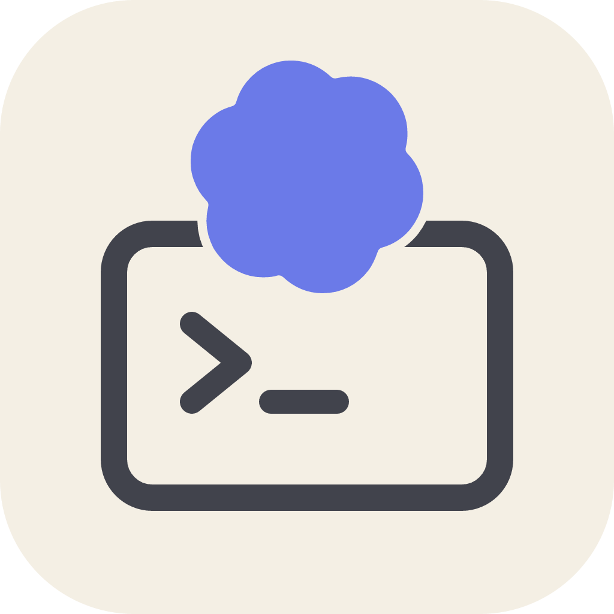

# Codex Delegate MCP

**Keep the brains. Delegate the build.**

[](https://www.npmjs.com/package/codex-delegate-mcp)
[](https://www.npmjs.com/package/codex-delegate-mcp)
[](https://nodejs.org)
[](LICENSE)
[](https://github.com/andreilungeanu/codex-delegate-mcp/actions/workflows/test.yml)



Use your best coding agent where its judgment matters most: understanding the task, shaping the plan, and reviewing the result.

Codex Delegate is the MCP bridge that lets Claude Code, Cursor, Copilot — or any MCP client — hand implementation to the **OpenAI Codex CLI**, then get a clean, structured result back for review.

<br clear="left">

## 🧠 Frontier quality, kept

Your assistant does what frontier models are actually for: understands the task, writes a precise brief, reviews the finished diff. Codex holds its own as the implementer — guided and checked by a smarter orchestrator. The result reads like frontier work, because a frontier model planned it and signed off on it.

## ⚡ Done faster

Codex tears through multi-file edits while a frontier chat model would still be streaming the first file. You delegate, keep working with your assistant, and the diff shows up done.

## 🔋 Your limits stop being the bottleneck

Delegated work runs on the **OpenAI Codex CLI** and its own usage — separate from your orchestrator's chat quota. Your Claude, Cursor, or Copilot subscription spends tokens on the brief and the review; Codex does the grinding. On API? That's the per-token grind moved off your main bill.

## 🔍 Results you can actually trust

An answer only counts as final if Codex exited cleanly and wrote its own last-message file. Cancel or time out a run and you still get the last thing Codex said — explicitly flagged as salvage, never passed off as finished work. And when Codex's tool calls fail inside a turn that otherwise looks clean, you get a warning saying so, because a confident summary of work that never happened is the expensive failure.

```
You  →  your agent (plans & reviews)
              │  MCP delegate tool
              ▼
        Codex CLI (implements)
              │  edits your workspace
              ▼
        Clean result: what changed, which files, the thread id
```

## Features

- 🤝 **Native plugins** — install into Claude Code, Cursor, or GitHub Copilot CLI and just say *"delegate this to Codex"*. The shared skill teaches your agent how to delegate well.
- 📦 **Clean, typed results** — validated structured output: the final answer, `status` plus a `reason` when it isn't `completed`, `threadId`, token `usage`, and the files Codex edited. Fields that carry no signal are omitted, so anything present is worth reading. A `warnings` entry always means something real; an empty one is not a clean bill of health, because the bridge sees the failures Codex reports as failed tool calls and not the ones it explains in prose.
- 📋 **Plan first** — `plan` mode returns a schema-validated plan. Review it, then resume the same thread to implement it.
- 💬 **Ask anything** — `ask` mode: read-only Q&A over your codebase, zero file changes.
- 🕵️ **Native code review** — `review` mode runs Codex's own reviewer over uncommitted work, a base branch, or a single commit.
- 🧵 **Resume** — continue the same Codex thread with `resumeThreadId`, and get told if the context didn't actually carry over.
- 🛑 **Cancel that means it** — process-tree kill across platforms, and `cancel` returns once the process has *ended*, not once the kill was requested. Name one run by `delegationId`, a whole thread by `threadId`, or cancel everything.
- 🧑‍🤝‍🧑 **Several at once** — up to three delegations run in parallel: fan a question out across models, or put independent workers on independent directories. Overlapping workspaces warn, because two agents writing one tree overwrite each other.
- 📊 **Token accounting** — per-turn input, cached, output, and reasoning counts, straight from Codex.
- 🩺 **Self-diagnosing** — a `doctor` tool that tells you exactly what's missing if setup isn't right.
- 🔌 **Works everywhere MCP does** — VS Code, JetBrains, Windsurf, Visual Studio, and more.

## Quick start

You need [Node.js 20+](https://nodejs.org/) and the [OpenAI Codex CLI](https://github.com/openai/codex) **0.144.0+**, already logged in (`codex login`).

### Claude Code

```shell
/plugin marketplace add andreilungeanu/codex-delegate-mcp
/plugin install codex-delegate-mcp@codex-delegate-mcp
```

Then just ask:

> Delegate to Codex: migrate src/api from callbacks to async/await and update the tests, then walk me through what changed.

That's the whole loop — Claude writes the brief, Codex grinds through the files, Claude walks you through the diff.

### Cursor

Add an MCP server in **Cursor Settings → MCP** (or project `.cursor/mcp.json`):

```json
{
  "mcpServers": {
    "codex-delegate-mcp": {
      "command": "npx",
      "args": ["-y", "codex-delegate-mcp"]
    }
  }
}
```

Then ask Cursor to delegate implementation to Codex the same way.

### GitHub Copilot CLI

```shell
copilot plugin install andreilungeanu/codex-delegate-mcp
```

### More clients

<details>
<summary><strong>VS Code</strong> — <code>.vscode/mcp.json</code></summary>

```json
{
  "servers": {
    "codex-delegate-mcp": {
      "type": "stdio",
      "command": "npx",
      "args": ["-y", "codex-delegate-mcp"]
    }
  }
}
```

Or run **Chat: Install Plugin From Source** with this repository's URL.

</details>

<details>
<summary><strong>JetBrains AI Assistant</strong> — Settings → Tools → AI Assistant → MCP</summary>

Under **Settings → Tools → AI Assistant → Model Context Protocol (MCP)**, add a server with command `npx` and arguments `-y codex-delegate-mcp`.

</details>

<details>
<summary><strong>Windsurf</strong> — <code>~/.codeium/windsurf/mcp_config.json</code></summary>

```json
{
  "mcpServers": {
    "codex-delegate-mcp": {
      "command": "npx",
      "args": ["-y", "codex-delegate-mcp"]
    }
  }
}
```

Heads-up: Cascade caps you at 100 tools across all servers.

</details>

<details>
<summary><strong>Visual Studio 2022</strong> — <code>%USERPROFILE%\.mcp.json</code></summary>

```json
{
  "servers": {
    "codex-delegate-mcp": {
      "type": "stdio",
      "command": "npx",
      "args": ["-y", "codex-delegate-mcp"]
    }
  }
}
```

Requires 17.14+. Note the top-level key is `servers`, not `mcpServers`.

</details>

### Kiro, Kilo Code, and any other MCP client

Add the following server to the client's MCP config:

```json
{
  "mcpServers": {
    "codex-delegate-mcp": {
      "command": "npx",
      "args": ["-y", "codex-delegate-mcp"]
    }
  }
}
```

## Good to know

This is a **worker** for an orchestrator host — not a replacement for Codex's first-party `codex mcp-server`. Your host writes the brief and reviews the diff; this bridge runs Codex with hooks disabled and your personal config ignored, then hands back evidence the host can trust. Treat the workspace as trusted: project `.codex` config still applies under Codex's normal precedence.

It works out of the box. Everything is tunable if you want it — models, reasoning effort, timeouts, Windows sandbox mode — in [Configuration](CONFIGURATION.md).

## License

MIT © [Andrei Lungeanu](https://github.com/andreilungeanu)

<sub>[Configuration](CONFIGURATION.md) · [Security](SECURITY.md) · [Privacy](PRIVACY.md) · [Terms](TERMS.md) · [Changelog](CHANGELOG.md)</sub>
